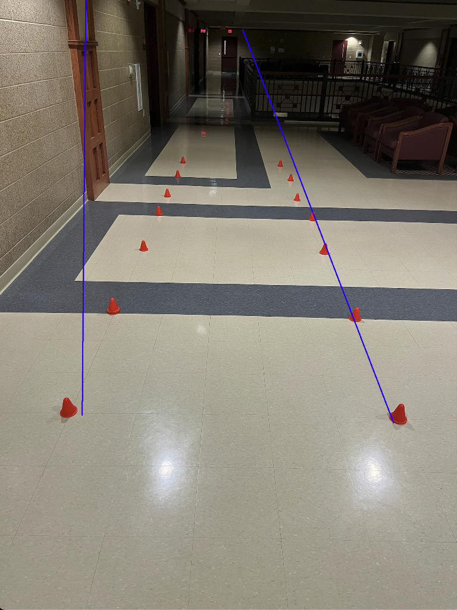

# Cone Detection and Path Boundary Drawing  

## answer.png  
  
This image shows the drawn boundary lines representing the path of the cones  

## Methodology  
1. **Load the Inital Image** – The first thing I had to do was load the intial image for OpenCV to read 
2. **Convert to HSV** – Research and ChatGPT reccomend that I detect cones with HSV color   
3. **Apply Color Mask** – A mask is created to detect red pixels corresponding to cones.  
4. **Extract Red Pixel Coordinates** – Instead of contours, the locations of all detected red pixels are collected.  
5. **Split Cones into Left and Right Groups** – The median x-coordinate is used to differentiate between left and right cones.  
6. **Fit Lines to Each Group of Cones** – With NumPy and the locations, a line is created to each set of cone positions.  
8. **Display the Result** – The final image, called answer.png, with boundary lines is shown using OpenCV.  

## What Did You Try and Why Did It Not Work?  
- I tried to hone in the detection of the cones so the lines would be more directly in-line with the cones, but this often lead to varying results, from not detecting real cones to detecting colors on the walls.
